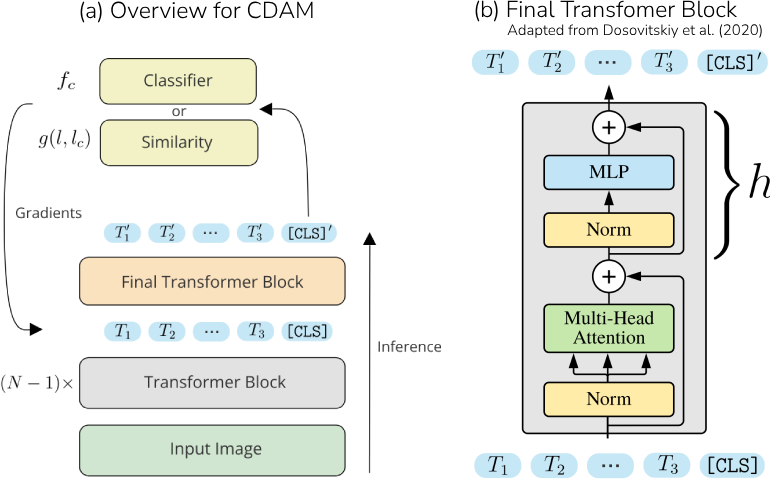

# Class-Discriminative Attention Maps (CDAM)


CDAM is a novel post-hoc explanation method for vision transformers (ViTs) that is highly sensitive to the chosen target class and reveals evidence and counter-evidence through signed relevance scores.

## Run notebook locally

To run [CDAM.ipynb](CDAM.ipynb) locally we recommend to create a Python >= 3.9 virtual environment, for example with [Mamba](https://github.com/mamba-org/mamba). Inside the environment run ```pip install -r requirements_local.txt``` and create a Jupyter kernel with ```python -m ipykernel install --user --name cdam_kernel```.

## Run notebook on Colab

[](https://colab.research.google.com/github/lenbrocki/CDAM/blob/main/attention_map.ipynb)

## Try Demo

Our [live demo](https://cdam.informatism.com) is the fastest way to try out CDAM!

## Introduction

We introduce CDAM, a novel method for visualizing input feature relevance of ViT classifications. CDAM scales the attention by how relevant the corresponding tokens are for the model's decision. Beyond targeting classifier outputs, we propose to create explanation for a similarity measure in the latent space of the ViT. This allows for explanations of *arbitary concepts*, defined by the user through a few sample images. 

CDAMs are obtained by calculating the gradients of the class or similarity score with respect to the tokens entering the final transformer block. The CDAM score $S_{i,c}$ is defined by 

$$
S_{i,c} = \sum_j T_{ij}\frac{\partial f_c}{\partial T_{ij}},
$$

where $T_{ij}$ is the $j$-th component of the $i$-th token that is fed to the last attention layer.

<p align="center">

</p>

